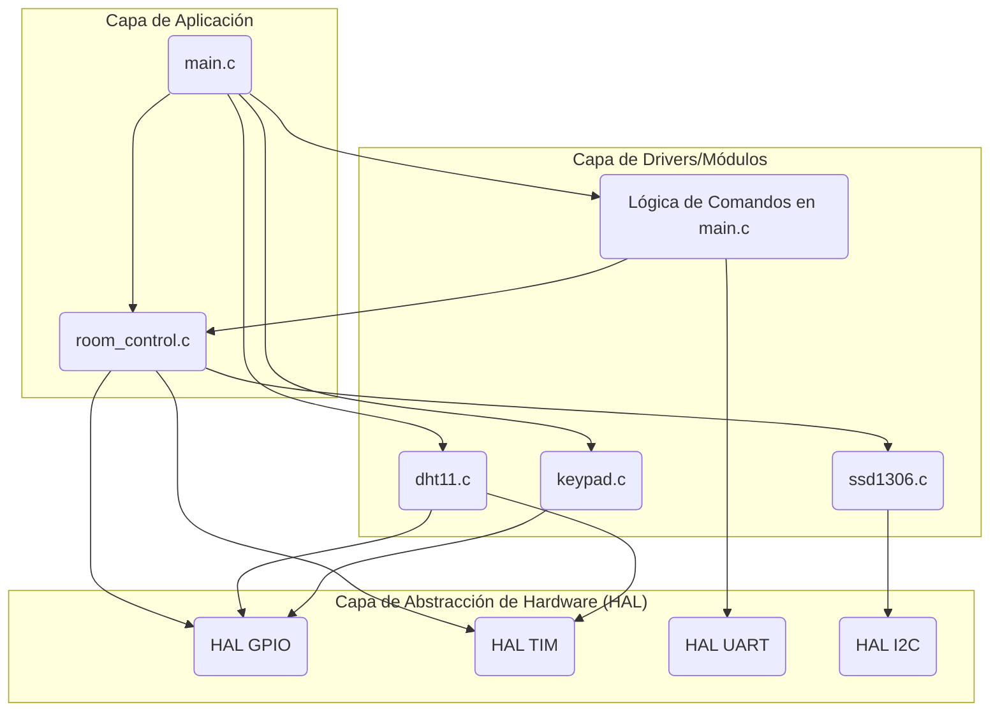

```markdown
# Informe del Proyecto: Sistema de Control de Sala Automático

Este documento detalla la arquitectura de hardware y firmware, el protocolo de comunicación y las técnicas de optimización empleadas en el desarrollo del sistema de control de sala.

## 1. Integrantes

*   Samuel Elias Gómez Muñoz

---

## 2. Arquitectura de Hardware

### 2.1. Diagrama de Conexiones

El siguiente diagrama muestra los componentes principales del sistema y cómo se interconectan con el microcontrolador STM32.

```mermaid
graph TD
    subgraph "Placa de Desarrollo"
        STM32L476RG(STM32L476RG)
    end

    subgraph "Periféricos de Entrada"
        Keypad[Teclado Matricial 4x4] -->|GPIOs de Filas/Columnas| STM32L476RG
        DHT11[Sensor de Temp/Humedad DHT11] -->|PAx (GPIO) & TIM6| STM32L476RG
        PC_Local[PC Local] -->|USB ST-Link (VCP)| USART2{USART2}
    end

    subgraph "Módulo de Conectividad"
        ESP01[Módulo WiFi ESP-01] <-->|TX/RX| USART3{USART3}
    end
    
    subgraph "Periféricos de Salida"
        OLED[Display OLED 128x64] <-->|I2C1 (SDA/SCL)| STM32L476RG
        Fan[Ventilador DC] <--|Señal PWM (TIM3)| STM32L476RG
        DoorLock[Actuador de Puerta] <--|GPIO| STM32L476RG
    end
    
    STM32L476RG -- Conexión --> USART2
    STM32L476RG -- Conexión --> USART3
```

### 2.2. Explicación de Componentes

*   **Microcontrolador (STM32L476RG):** Es el cerebro del sistema. Ejecuta el firmware principal, gestiona los periféricos, procesa los datos de los sensores y toma decisiones de control.
*   **Sensor de Temperatura y Humedad (DHT11):** Mide las condiciones ambientales de la sala. Se comunica a través de un único pin de datos (GPIO), y su timing preciso es gestionado con la ayuda de un temporizador (TIM6) para medir la duración de los pulsos.
*   **Display OLED (SSD1306):** Actúa como la interfaz de usuario visual principal, mostrando el estado del sistema, la temperatura, la velocidad del ventilador y los menús de acceso. Se conecta a través del bus I2C1.
*   **Teclado Matricial 4x4:** Es el principal método de entrada local para que el usuario ingrese la contraseña y controle el sistema. Su lectura se optimiza mediante interrupciones en los pines de las columnas.
*   **Ventilador DC:** Es el actuador principal para regular la temperatura. Su velocidad se controla de forma precisa mediante una señal PWM (Modulación por Ancho de Pulso) generada por el TIM3.
*   **Módulo WiFi (ESP-01):** Proporciona la conectividad remota. Se utiliza con el firmware `esp-link` para actuar como un puente transparente entre UART y TCP/IP, permitiendo la comunicación a través de la red WiFi. Se conecta al microcontrolador a través del periférico USART3.
*   **Consola de Depuración (USART2):** A través del ST-Link (Virtual COM Port), se establece una consola de comandos local para depuración y control directo desde un PC.

---

## 3. Arquitectura de Firmware

### 3.1. Patrones de Diseño Aplicados

El firmware se estructura en torno a dos patrones de diseño principales para garantizar un funcionamiento robusto y eficiente.

*   **Super Loop (Bucle Principal):** El núcleo del programa reside en el bucle infinito `while(1)` dentro de `main.c`. Este patrón se encarga de ejecutar tareas no bloqueantes de forma continua. En cada iteración, el bucle:
    1.  Llama a la función `heartbeat()` para indicar visualmente que el sistema está operativo.
    2.  Actualiza la máquina de estados principal (`room_control_update`).
    3.  Gestiona la lectura no bloqueante del sensor DHT11.
    4.  Comprueba si se han recibido comandos por los puertos serie.
    5.  Comprueba si se ha pulsado una tecla en el keypad.

*   **Máquina de Estados (State Machine):** El control lógico del sistema se implementa como una máquina de estados finitos dentro del módulo `room_control`. Esto permite un manejo claro y seguro de los diferentes modos de operación. Los estados definidos son:
    *   `ROOM_STATE_LOCKED`: El estado por defecto y más seguro. El sistema está bloqueado y solo responde a intentos de ingreso de contraseña.
    *   `ROOM_STATE_INPUT_PASSWORD`: El sistema está esperando que el usuario ingrese los 4 dígitos de la contraseña.
    *   `ROOM_STATE_UNLOCKED`: Acceso concedido. En este estado, el usuario puede interactuar con las funciones del sistema, como forzar la velocidad del ventilador.
    *   `ROOM_STATE_ACCESS_DENIED`: Un estado temporal que se muestra cuando la contraseña ingresada es incorrecta, antes de volver automáticamente al estado `LOCKED`.

### 3.2. Diagrama de Componentes de Software

El firmware está modularizado para separar responsabilidades, facilitando el mantenimiento y la escalabilidad.



---

## 4. Protocolo de Comandos

Se ha implementado un protocolo de comandos basado en texto simple, accesible a través de la consola local (USART2) y la consola remota (USART3). Los comandos finalizan con un carácter de nueva línea (`\n`).

| Comando         | Parámetros        | Descripción                                                                 | Requiere Autenticación (Remoto) | Requiere Estado Desbloqueado |
|:----------------|:------------------|:----------------------------------------------------------------------------|:-------------------------------:|:----------------------------:|
| `GET_TEMP`      | Ninguno           | Devuelve la temperatura actual medida por el sensor DHT11.                  | No                              | No                           |
| `GET_STATUS`    | Ninguno           | Devuelve el estado actual del sistema (Bloqueado/Desbloqueado, modo y nivel del ventilador). | No                              | No                           |
| `LOGIN`         | `XXXX` (contraseña) | Autentica la sesión remota para permitir el uso de comandos protegidos.       | N/A                             | No                           |
| `LOGOUT`        | Ninguno           | Cierra la sesión remota autenticada.                                        | Sí                              | No                           |
| `SET_PASS`      | `XXXX` (nueva pass) | Cambia la contraseña del sistema.                                           | Sí                              | Sí                           |
| `FORCE_FAN`     | `N` (0, 40, 70, 100) | Fija la velocidad del ventilador a un nivel específico, ignorando la temperatura. | Sí                              | Sí                           |
| `AUTO_FAN`      | Ninguno           | Devuelve el control del ventilador al modo automático basado en temperatura.  | Sí                              | Sí                           |

---

## 5. Técnicas de Optimización Aplicadas

Para asegurar un rendimiento fluido y un bajo consumo de CPU, se han aplicado varias técnicas de optimización:

1.  **Manejo de E/S por Interrupciones:** En lugar de usar bucles de sondeo (polling) que consumen CPU, la recepción de datos por `USART` y la detección de pulsaciones en el `keypad` se manejan mediante interrupciones. Esto permite que el microcontrolador realice otras tareas o entre en modos de bajo consumo mientras espera eventos externos.

2.  **Lógica No Bloqueante (Non-Blocking):** El driver del sensor DHT11 está implementado como una máquina de estados no bloqueante. En lugar de detener todo el programa con `HAL_Delay()` mientras se espera la respuesta del sensor, la función `DHT11_Process()` se llama en cada ciclo del bucle principal, avanzando en la lectura del sensor paso a paso sin bloquear otras tareas.

3.  **Actualización de Pantalla por Eventos:** La pantalla OLED no se redibuja en cada ciclo del bucle principal, lo cual sería muy ineficiente y generaría un tráfico I2C constante. En su lugar, se utiliza una bandera (`display_update_needed`). La pantalla solo se actualiza cuando un evento relevante ocurre (un cambio de estado, una nueva lectura de temperatura, etc.), optimizando significativamente el rendimiento.
```

