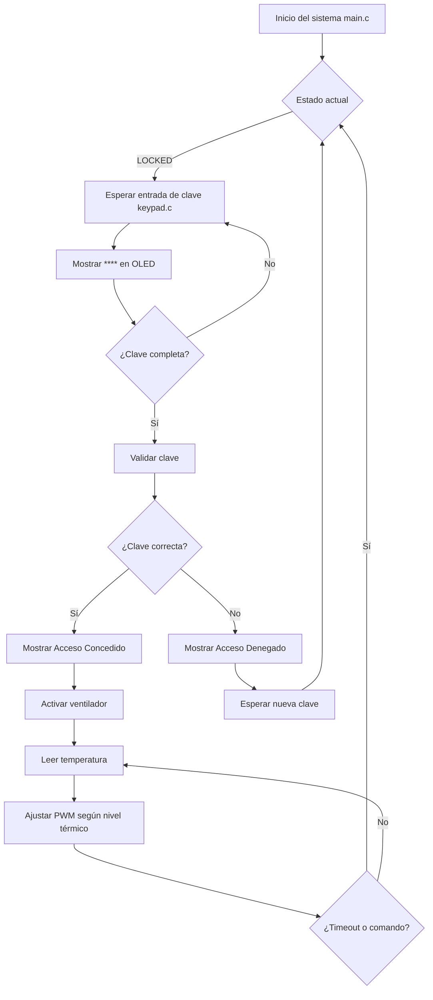

# Informe del Proyecto: Sistema de Control de Sala Automático

En este informe se busca explicar brevemente el funcionamiento del proyecto final, en el cual, se busca controlar remotamente el acceso a una habitación y su ventilación, haciendo uso de un teclado, un display OLED, sensores de temperatura y control PWM de ventilador.

## 1. Integrantes.

*   Mateo Cárdenas Cuesta 1059696999
*   Juan Fernando Martinez 1084221744 

---

## 2. Componentes utilizados.

### 2.1. Hardware:

*   **Placa principal:** STM32 Núcleo-L476RG.
*   **Pantalla OLED:** (I2C).
*   **Teclado matricial:** 4x4.
*   **Sensor de temperatura:** DHT11.
*   **Módulo ventilador:** Controlado por PWM.
*   **Actuador de puerta (simulado por LED)**
*   **(ESP-01 previsto pero no implementado)**

### 2.2. Software:

*   **STM32CubeIDE**
*   **HAL Drivers**
*   **Librerias para SSD1306 y DHT11**
*   **Código en C estructurado en módulos (main.c, room_control.c)**

---

## 3. Arquitectura del Sistema.

### 3.1. Máquina de Estados (room_control.c):

*   **ROOM_STATE_LOCKED:** Estado inicial, puerta bloqueada.
  
*   **ROOM_STATE_INPUT_PASSWORD:** Se espera a que sea ingresada una clave (0000).

*   **ROOM_STATE_UNLOCKED:** Acceso concedido, habilita el control de ventilación.

*   **ROOM_STATE_ACCESS_DENIED:** En caso de clave incorrecta, acceso denegado.

### 3.2. Diagrama de Componentes de Software:

---

## 4. Descripción funcional.

### 4.1 Ingreso de Clave:
*   Usuario introduce una clave de 4 dígitos usando el teclado.
*   Al completarla, se compara con la clave por defecto, en este caso "0000".
*   **Si es correcta:** Se desbloquea la puerta y se habilita la visualización de temperatura y ventilador.
*   **Si es incorrecta:** Se muestra "ACCESO DENEGADO" y luego se bloquea.

### 4.2 Control del Ventilador:
*   Modo automático por defecto (basado en temperatura):
      1. "<" 25 °C apagado.
      2. 25 - 28 °C nivel bajo.
      3. 28 - 31 °C nivel medio.
      4. ">" 31 °C nivel alto.

### 4.3 Pantalla OLED:
*   Muestra distintos mensajes según el estado:
     1. Sistema bloqueado.
     2. Ingreso de clave (con asteriscos).
     3. Acceso permitido con la temperatura actual y el nivel del ventilador.
    4. Acceso denegado.

### 4.4 Control de puerta:
*   Simulado con un pin de salida (GPIO), activo o inactivo dependiendo del estado. 
---

## 5. Módulo room_control.c

Resumen de funciones clave:

1.  **room_control_init():** Inicializa todos los elementos del sistema.

2.  **room_control_update():** Ejecutada periódicamente; maneja los estados y el display.

3.  **room_control_process_key():** Procesa las entradas del teclado.

4.  **room_control_set_temperature():** Actualiza temperatura y nivel de ventilador.

5.  **room_control_force_fan_level():** modo manual.

6.  **room_control_update_display():** Actualiza OLED.

7.  **room_control_update_fan_pwm():** Aplica nivel PWM.

8.  **room_control_change_state():** Transición segura de los estados.
---

## 6. Técnicas de Optimización.

Durante el desarrollo del sistema embebido se implementaron diversas técnicas de optimización tanto a nivel de software como en el uso eficiente de los recursos del microcontrolador STM32L476RG. Estas optimizaciones fueron clave para garantizar un funcionamiento fluido, bajo consumo y buena capacidad de respuesta del sistema.

###  6.1. Estructura modular del código: 
*   Se utilizó una estructura modular separando el código en archivos como room_control.c, dht11.c, keypad.c y controladores de periféricos. Esto no solo mejora la organización y mantenibilidad, sino que permite la reutilización de código y la compilación selectiva, lo cual reduce el tamaño del binario final.

###  6.2. Máquina de estados finitos:
*   El sistema de control de acceso y climatización se diseñó utilizando una máquina de estados finitos, lo que permite gestionar eventos de forma ordenada y eficiente, minimizando el uso de recursos al evitar estructuras de control complejas como múltiples condicionales anidados.

###  6.3. Uso eficiente del display OLED:
*   El contenido mostrado en la pantalla se actualiza únicamente cuando hay un cambio relevante de estado. Esta técnica reduce el número de escrituras al display, que son costosas en tiempo, y disminuye el uso del bus I2C, permitiendo que otros periféricos puedan operar sin interferencias.

###  6.4. Control por PWM con resolución adecuada:
*   El control del ventilador se implementó utilizando PWM con una frecuencia y resolución que equilibran precisión y eficiencia energética. Se evita el uso de retardos innecesarios y se aprovecha el temporizador hardware para generar la señal sin intervención constante del procesador.

###  6.5. Optimización en lectura de sensores:
*   La lectura del sensor de temperatura se realiza de forma periódica, evitando consultas excesivas que puedan saturar el sistema o generar latencias en la respuesta del sistema. Además, se filtran lecturas erróneas para evitar procesamientos innecesarios.